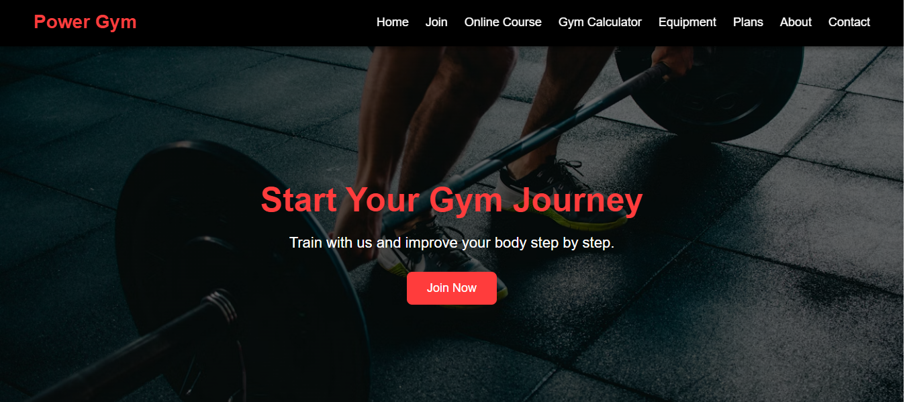
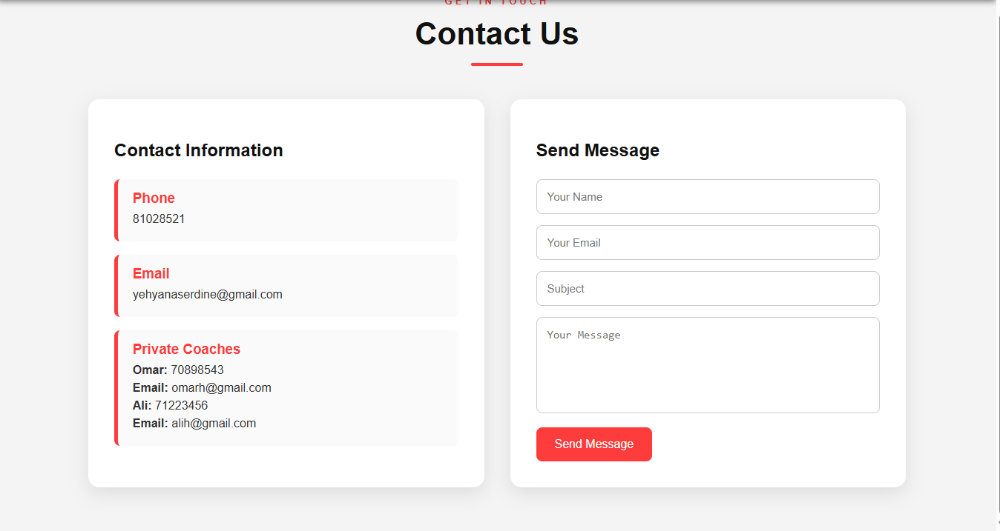

# Power Gym React Project

## Project Description
This project is a responsive fitness web application built using ReactJS and Vite. It includes multiple pages such as Home, About, Plans, Join, Calculator, Contact, Course, and Equipment.

The website helps users explore gym plans, view equipment, join the gym, contact the team, and use a gym calculator.

## Pages
- Home
- About
- Plans
- Join
- Calculator
- Contact
- Course
- Equipment

## Technologies Used
- ReactJS
- Vite
- CSS
- React Router
- Git
- GitHub

## Setup Instructions
```bash
npm install
npm run dev
## Screenshots of UI

### Home Page


### About Page

(public/screenshots/about2.png)
### Plans Page

(public/screenshots/plan2.png)
### Join Page


### Calculator Page


### Contact Page

##Github repository
https://github.com/82330148-byte/POWER-GYM-REACT
## live demo
  https://power-gym-react.vercel.app 